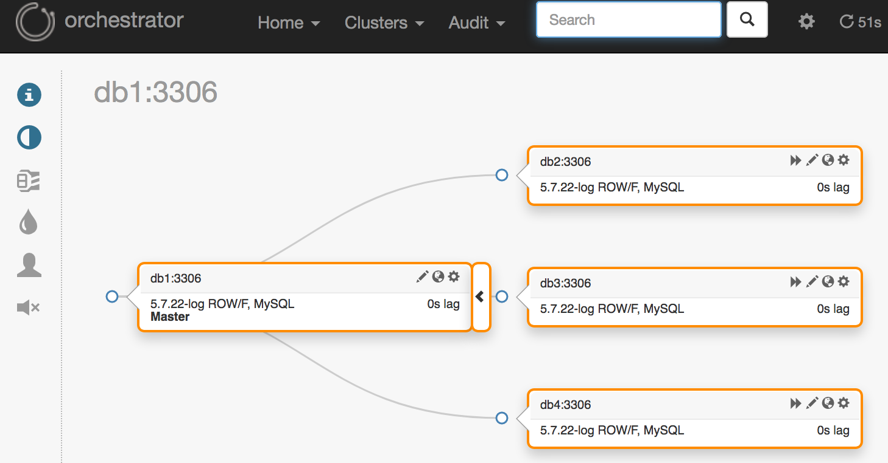

# Orchestrator on Raft

## Building and running full testing cluster
```
docker-compose up
```
This will bring up one MySQL master and three replicas
along side three orchestrator nodes in HA (Raft)

```
$ docker-compose exec orchestrator1 resources/bin/orchestrator-client -c topology --alias db1
db1:3306   [0s,ok,5.7.22-log,rw,ROW,P-GTID]
+ db2:3306 [0s,ok,5.7.22-log,rw,ROW,>>,P-GTID]
+ db3:3306 [0s,ok,5.7.22-log,rw,ROW,>>,P-GTID]
+ db4:3306 [0s,ok,5.7.22-log,rw,ROW,>>,P-GTID]
```



## Building and running only one instance of orchestrator
```
docker-compose up orchestrator1
```

Once orchestrator and haproxy is running it can be accessed through the following URL.

* http://127.0.0.1:8080

This will only proxy to the current Raft leader
